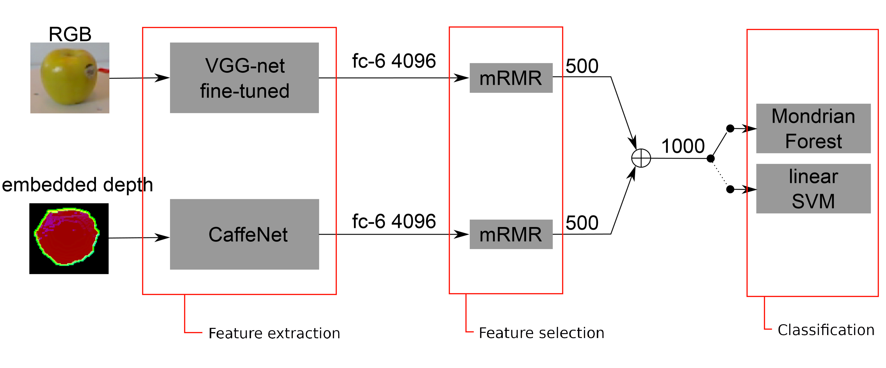

# Details
Final project of Cognitive Robotics by:
<ul>
  <li>Sohyung Kim (S3475743)</li>
  <li>Thijs Eker (S2576597)</li>
  <li>Dhawal Salvi (S4107624)</liv>
  <li>Ewout Bergsma (S3441423)</li>
</ul>

# File descriptions
<ul>
  <li>
    CPP/include/good.h -- good descriptor header file from https://github.com/SeyedHamidreza/GOOD_descriptor
  </li>
  <li>
    CPP/CMakeLists.txt -- Cmake file for building the cpp code
  </li>
  <li>
    CPP/good.cpp -- good descriptor implementation from https://github.com/SeyedHamidreza/GOOD_descriptor
  </li>
  <li>
    CPP/main.cpp -- the main file called by python for building feature histograms for VFH, GOOD5 and GOOD15
  </li>

  <li>
    build_additional_dataset.py -- additional script for also computing the GOOD5 and GOOD15 descriptions
  </li>
  <li>
    build_dataset.py -- the main script for building the dataset, this files reads pngs and scales the to 224*224 and reads in pointclouds to compute VFH descritions.
  </li>
  <li>
    create_image_features.py -- NOT USED IN PAPER
  </li>
  <li>
    cross_validation_example.py --REMOVE
  </li>
  <li>
    cross_validation_for_al_mf.py
  </li>
  <li>
    cross_validation_for_al_mf_intermediate_updates.py
  </li>
  <li>
    cross_validation_for_non_al_mf.py
  </li>
  <li>
    final_general_functions.py
  </li>
  <li>
    final_mf_all_image_features.py	-- NOT USED IN PAPER
  </li>
  <li>
    final_mf_vfh_and_all_image_features.py	-- NOT USED IN PAPER
  </li>
  <li>
    final_mf_vfh_features.py	-- REMOVE
  </li>
  <li>
    jobscript_all_image_features	-- NOT USED IN PAPER
  </li>
  <li>
    jobscript_test_al	-- REMOVE
  </li>
  <li>
    jobscript_vfh_and_all_image_features	-- NOT USED IN PAPER
  </li>
  <li>
    jobscript_vfh_features	-- REMOVE
  </li>
  <li>
    load_dataset.py
  </li>
  <li>
    mondrian_forest_classifier_with_al_strategy.py -- Implemanatation of a fit method using the described querying strategy
  </li>
  <li>
    mrmr_feature_selection.py -- mrmr feature selection using skfeature-chappers package NOT USED IN PAPER
  </li>
  <li>
    mrmr_feature_selection_2.py	-- multithreaded mrmr feature selection using mifs package NOT USED IN PAPER
  </li>
  <li>
    requirements.txt	-- UPDATE THIS
  </li>
  <li>
    rf_hyperparam_search.py	 -- hyperparameter search for random forest NOT USED IN PAPER
  </li>
  <li>
    run_exec.py	-- python file calling the compiled C++ code from the CPP/ folders
  </li>
  <li>
    train_svm.py	-- file for testing SVM on VFH data NOT USED IN PAPER
  </li>
  <li>
    utils.py	-- file with tsome definitions(like the category names)
  </li>
</ul>

# General idea
Implement this:

