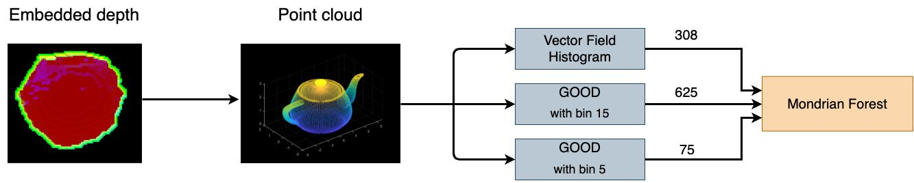

# Details
Final project of Cognitive Robotics by:
<ul>
  <li>Sohyung Kim (S3475743)</li>
  <li>Thijs Eker (S2576597)</li>
  <li>Dhawal Salvi (S4107624)</liv>
  <li>Ewout Bergsma (S3441423)</li>
</ul>

# File descriptions
<ul>
  <li>
    CPP/include/good.h -- good descriptor header file from https://github.com/SeyedHamidreza/GOOD_descriptor
  </li>
  <li>
    CPP/CMakeLists.txt -- Cmake file for building the cpp code
  </li>
  <li>
    CPP/good.cpp -- good descriptor implementation from https://github.com/SeyedHamidreza/GOOD_descriptor
  </li>
  <li>
    CPP/main.cpp -- the main file called by python for building feature histograms for VFH, GOOD5 and GOOD15
  </li>

  <li>
    build_additional_dataset.py -- additional script for also computing the GOOD5 and GOOD15 descriptions
  </li>
  <li>
    build_dataset.py -- the main script for building the dataset, this files reads pngs and scales the to 224*224 and reads in pointclouds to compute VFH descritions.
  </li>
  <li>
    create_image_features.py -- used to compute 4096 features from the scaled images using VGG NOT USED IN PAPER
  </li>
  <li>
    cross_validation_for_al_mf.py -- The script used for calculating the final Active learning results for the paper
  </li>
  <li>
    cross_validation_for_non_al_mf.py -- This script was used for calculating the final offline learning results in the paper.
  </li>
  <li>
    final_general_functions.py	-- these script were used for RGB results NOT USED IN PAPER
  </li>
  <li>
    final_mf_all_image_features.py	-- these script were used for RGB results NOT USED IN PAPER
  </li>
  <li>
    final_mf_vfh_and_all_image_features.py	-- these script were used for RGB results NOT USED IN PAPER
  </li>
  <li>
    load_dataset.py -- This script contains the functionality for loading the different datasets used in our research (VFH, GOOD5, GOOD15)
  </li>
  <li>
    mondrian_forest_classifier_with_al_strategy.py -- Implementation of a fit method using the described querying strategy (The AL is implemented here!)
  </li>
  <li>
    mrmr_feature_selection.py -- mrmr feature selection using skfeature-chappers package NOT USED IN PAPER
  </li>
  <li>
    mrmr_feature_selection_2.py	-- pymrmr feature selection NOT USED IN PAPER
  </li>
  <li>
    mrmr_feature_selection_3.py	-- multithreaded mrmr feature selection using mifs package NOT USED IN PAPER
  </li>
  <li>
    requirements.txt	-- UPDATE THIS
  </li>
  <li>
    rf_hyperparam_search.py	 -- hyperparameter search for random forest NOT USED IN PAPER
  </li>
  <li>
    run_exec.py	-- python file calling the compiled C++ code from the CPP/ folders
  </li>
  <li>
    train_svm.py	-- file for testing SVM on VFH data NOT USED IN PAPER
  </li>
  <li>
    utils.py	-- file with some definitions(like the category names)
  </li>
</ul>

# Running instructions
<ul>
    <li>
        Compile the c++ code in the CPP/ folder
    </li>
    <li>
        Install the python packages in requirements.txt
    </li>
    <li>
        Build the dataset by:  
        1. downloading the files from washington university site 
        <a href="https://rgbd-dataset.cs.washington.edu/dataset/rgbd-dataset_eval/">eveluation set</a> and <a href="https://rgbd-dataset.cs.washington.edu/dataset/rgbd-dataset_pcd_ascii/">point clouds</a>  
        2. Point the EVAL_DATASET_PATH, PC_DATASET_PATH, OUTPUT_DATASET_PATH variables to the downloaded folders 
        3. run <code>build_dataset.py</code> and after that <code>build_additional_dataset.py</code>
    </li>
    <li>
        Run either the <code>cross_validation_for_al_mf.py shape_descriptor confidence_threshold</code>(shape descriptor should be 0(VFH), 1(GOOD5) or 2(GOOD15)) or <code>cross_validation_for_non_al_mf.py</code>
    </li>
</ul>

# General idea
Implement this:

